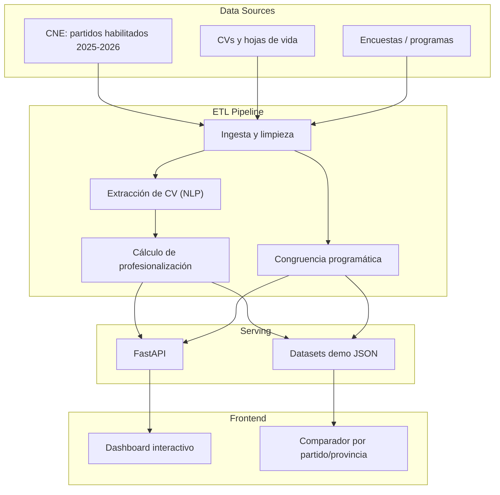

# Índice de Profesionalización de Partidos y Candidatos · Ecuador

> **Status:** `Staging` (datos sintéticos representativos hasta publicación oficial del CNE) · **Domain:** Electoral Analytics / Civic Tech · **Last validated:** 2026-08

[](LICENSE)
[](https://python.org)
[](.github/workflows/ci.yml)
[](.github/workflows/deploy-web-pages.yml)

## 📌 Executive Summary

Repositorio reproducible que calcula el **Índice de Profesionalización** de candidatos/as a
Prefecturas, Alcaldías y Concejalías en las **Elecciones Seccionales Ecuador · Noviembre 2026**.
Metodología transparente: **60% formación académica + 40% experiencia en servicio público**,
agregado en un índice 0–100 por candidato, partido, provincia y dignidad, con ETL, API FastAPI y
frontend interactivo. Hasta que el CNE publique el registro oficial, los datos son **sintéticos y
representativos** (calibrados con partidos habilitados y distribución educativa histórica).

## 🎯 Business Impact & KPIs

| Business problem | KPI optimized | Baseline | Target | Observed |
|---|---|---|---|---|
| Votantes sin información comparable sobre candidatos | Cobertura de candidatos con índice | Sin herramienta | 100% del registro | **Índice 0–100 por candidato** (pipeline listo) |
| Debates electorales poco informados | Transparencia de formación y experiencia | Sin datos | Publicación ciudadana | **Frontend + API operativos** |
| Método no reproducible en otros procesos | Reproducibilidad | Ad-hoc | Documentada | **ETL + tests + CI** |

**Por qué importa:** la calidad del voto depende de la información disponible. Este índice
transparenta formación académica y experiencia pública de cada precandidato, fomentando debate
informado y accountability electoral.

## 🧠 Methodology & Statistical Rigor

- **Hipótesis:** la profesionalización de un candidato se aproxima con una combinación ponderada de
  formación académica (60%) y experiencia en servicio público (40%).
- **Enfoque:** índice compuesto normalizado 0–100 con agregación por partido, provincia y dignidad;
  análisis estadístico reproducible (distribuciones, comparaciones por partido) e integración de
  congruencia programática entre propuestas.
- **Supuestos:** los datos sintéticos actuales calibran distribuciones educativas según perfiles
  históricos de cada partido; serán **reemplazados por datos oficiales del CNE** (estimado 45–60 días
  antes de las elecciones) sin cambios de metodología.
- **Tests de estabilidad:** pruebas unitarias de ETL y API (`tests/`), CI en cada push, y validación
  de esquemas contra el formato oficial del CNE.

### Ecuaciones clave

Índice de profesionalización del candidato $c$:

$$P_c = 0.60 \cdot F_c + 0.40 \cdot E_c \in [0, 100]$$

Agregación por partido $p$ (ponderada por dignidad):

$$P_p = \frac{1}{N_p} \sum_{c \in p} P_c$$

## 🏗️ System Architecture



## 📊 Results

| Metric | Value | Detail |
|---|---|---|
| Metodología | 60/40 (formación/experiencia) | Documentada en `METHODOLOGY.md` |
| Cobertura del pipeline | Todos los partidos habilitados | Datos sintéticos calibrados hasta registro oficial |
| Calidad de software | Tests + CI + deploy Pages | `tests/`, GitHub Actions |
| Congruencia programática | Scores por partido | `data/demo/congruence_scores.json` |

## 🛠️ Tech Stack

| Layer | Tools |
|---|---|
| Orchestration / ETL | Python, scripts de ingesta (CNE, CVs, encuestas), NLP ligero |
| Modeling / Analytics | Índice compuesto, extracción de temas (NLP), estadística descriptiva |
| Deployment | FastAPI, Docker, frontend web interactivo, GitHub Pages + CI/CD |

## 📂 Project Structure

```
.
├── src/
│   ├── etl/            # congruence, professionalization, cv_extraction, theme_extraction, stats, turnout
│   └── api/            # FastAPI: main, congruencia
├── scripts/            # descarga CNE, ingesta, generación de datos demo, scraping CVs
├── data/demo/          # Datasets demo (candidatos, índices, congruencia, participación)
├── notebooks/          # Análisis reproducible
├── docs/               # Fuentes y metodología de congruencia
├── tests/              # test_congruence, test_etl_and_api
├── config/             # themes.yml
├── METHODOLOGY.md
└── .github/workflows/  # ci.yml, deploy-web-pages.yml
```

## 🚀 Quick Start

```bash
git clone https://github.com/jordanvt18/perfil-profesionalizacion-partidos-ecuador
cd perfil-profesionalizacion-partidos-ecuador
python -m venv .venv && source .venv/bin/activate
pip install -r requirements.txt

# 1. Generar/actualizar datos (demo o extracción real)
python scripts/generate_frontend_demo_data.py
# 2. Tests
pytest
# 3. API
uvicorn src.api.main:app --reload
```

**Requisitos:** Python 3.10+, acceso a cne.gob.ec para la ingesta oficial cuando se publique el registro.

## 📈 Monitoring & Governance

- **Actualización:** reemplazo planificado de datos sintéticos por el registro oficial del CNE (ventana 45–60 días pre-elección).
- **Calidad:** CI con tests de ETL y API en cada push; validación de esquemas contra el formato CNE.
- **Reproducibilidad:** datasets demo versionados, metodología en `METHODOLOGY.md`, fuentes documentadas en `docs/sources.md`.
- **Transparencia:** todo dato sintético está marcado explícitamente como tal hasta su reemplazo por información oficial verificada.
